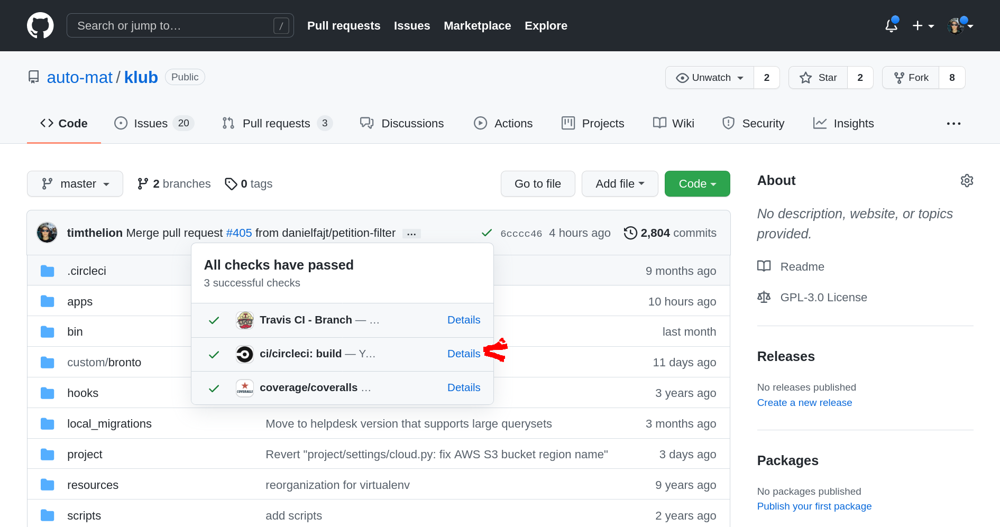
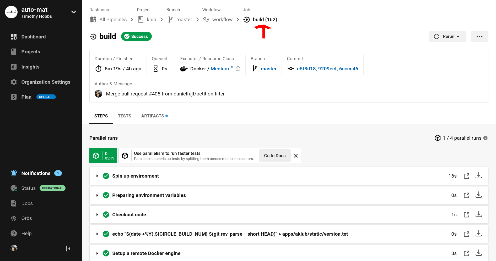
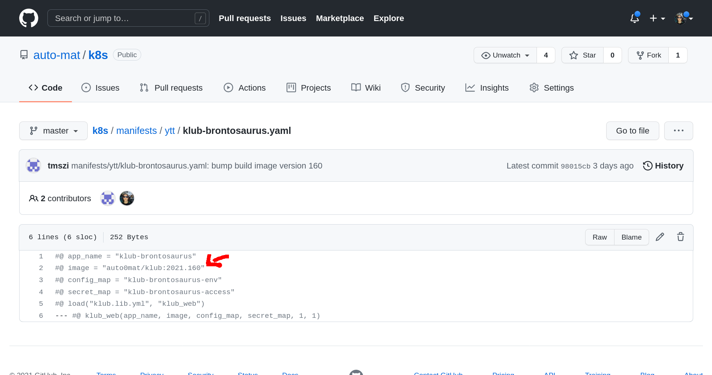
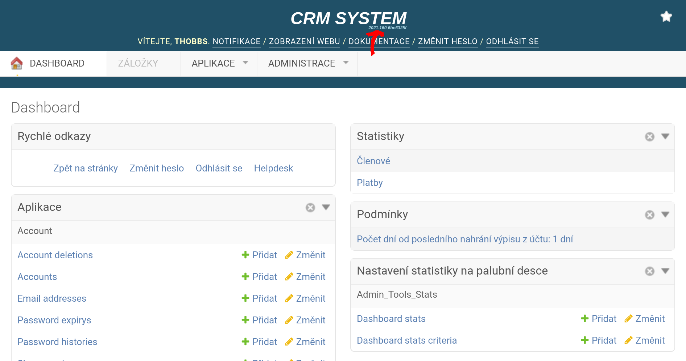

Kuberenets manifests for Auto*mat z.s. internal infrastructure
-------------------------------------------------------------------

These manifests are used for [Auto*mat's](https://auto-mat.cz/) internal infrastructure. These manifests, combined with manifests stored in our private AWS code commit repository (the secrets), allow for the deployment of much of Auto*mat's internal IT infrastructure.

Currently these manifests are installed on a k8s cluster running on [DigitalOcean](https://cloud.digitalocean.com/projects?i=99d236). Changes are automatically applied when you push changes to the main repo.

Deploying: The basics
---------------------

1. Find the build number (you can look it up in the circleci [All Pipelines](https://app.circleci.com/pipelines/github/auto-mat) view)


2. Set the build number in the manifest.

3. Commit and push this repository
4. Verify the deployment.
```
timothy@yoga ~> kubectl get pods | grep bronto
klub-brontosaurus-79478c5d7f-f9q4r                           1/1     Running     0          2d18h
klub-brontosaurus-celery-8599fff748-htxdk                    1/1     Running     0          2d22h
klub-brontosaurus-celery-beat-74dc46675d-59fb7               1/1     Running     0          2d22h
klub-brontosaurus-redis-5544ffd69c-vwtj7                     1/1     Running     0          28d
```

```
timothy@yoga ~> kubectl describe pod klub-brontosaurus-79478c5d7f-f9q4r
Name:         klub-brontosaurus-79478c5d7f-f9q4r
Namespace:    default
Priority:     0
Node:         pool-xku34vorr-8zp7f/10.114.0.9
Start Time:   Mon, 11 Oct 2021 19:01:33 +0200
Labels:       app=klub-brontosaurus
              pod-template-hash=79478c5d7f
Annotations:  <none>
Status:       Running
IP:           10.244.0.103
IPs:
  IP:           10.244.0.103
Controlled By:  ReplicaSet/klub-brontosaurus-79478c5d7f
Containers:
  klub-brontosaurus:
    Container ID:  containerd://27f9b218e5223a531c0cae7ae90104507bd34bad27f22d9a2e5a1133e1ada05d
    Image:         auto0mat/klub:2021.160
```


Connecting directly to a DB using psql
------------------------------------

1. You need `psql` and the postgres 12 client libraries installed. As postgres 12 is a bit of an uncommon version, you'll need to install them  [directly from postgres](https://computingforgeeks.com/install-postgresql-12-on-ubuntu/).
2. If you are administring from a new computer, you need to register your IP address before you can connect. On the [Overview page on the DO console](https://cloud.digitalocean.com/databases/db-postgresql-fra1-18178/users?i=99d236) you will find an "Edit sources" link where you can do this.
3. Login information for connecting to the database CLI is also found on the [Overview page on the DO console](https://cloud.digitalocean.com/databases/db-postgresql-fra1-18178/users?i=99d236). In the connection details section you will find a drop down labled "Connection parameter", select "Flags". You will also find drop downs for selecting the db name and user. Then use the "Copy" button and paste the command to bash. 

Adding databases
----------------

Databases are stored using digital ocean's managed database solution. When creating a new database, you should create a new user for that database, revoke the "doadmin" role for that user, and give it ownership of the database.

Database and user creation is done on [the Users & Databases page of the DO console](https://cloud.digitalocean.com/databases/db-postgresql-fra1-18178/users?i=99d236)

After you have created the db, you need to connect to the DB using psql to finish the process. See the section above, you'll want to connect as `doadmin`. The commands for setting the DB owner and revoking admin permissions for a new user are as follows:

`ALTER DATABASE "klub-automat" OWNER TO "klub-automat";`

`REVOKE "klub-automat" from "doadmin";`

You should replace `klub-automat` with the name of the database and user that you are configuring.

Adding new klub přatel instances
--------------------------------

Note, before following these instructions blindly, read them first. When setting up test instances not all steps may be applicable/necessary.

1. Clone the `k8s-secrets` repo from [AWS code commit](https://eu-west-1.console.aws.amazon.com/codesuite/codecommit/repositories/k8s-secrets/browse/refs/heads/master/--/manifests?region=eu-west-1) and copy the `klub-automat.yaml` file.
2. Create a new s3 bucket for storing media files. Use the [automat-klub-prod](https://s3.console.aws.amazon.com/s3/buckets/automat-klub-prod?region=eu-west-1&tab=objects) bucket for reference when setting permissions.
3. In [IAM](https://console.aws.amazon.com/iam/home?region=eu-west-1#/users/Heroku-diakonie) create a new users for your klub přatel instance. Use the `aklub-diakonie` user for reference when setting permissions.
4. Copy the keys for this new IAM user to your new secrets yaml file.
5. In [SES](https://eu-west-1.console.aws.amazon.com/ses/home?region=eu-west-1#verified-senders-email:) configure and verify the email addresses that your new klub přatel instance will be sending emails from.
6. In [sentry](https://sentry.io/organizations/automat-zs/projects/) create a new project.
7. Copy the raven URL for the new project to your secrets yaml file.
8. Create a new database (see above) with digital ocean and set the password and user in the secrets yaml file.
9. Generate a new secret key (you can use the `mcookie` command on linux for this) for your project and put it in the secrets yaml file.
10. Replace all instances of the string `klub-automat` with the name of your new instance.
11. Apply your secrets file to the k8s cluster with `kubectl apply -f <secrets-file>.yaml`.
12. Commit your secrets file and push it to AWS code commit.
13. Clone the `https://github.com/auto-mat/k8s/` repository and copy the [`klub-automat.yaml`](https://github.com/auto-mat/k8s/blob/master/manifests/config-maps/klub-automat.yaml) config map.
14. Replace all instances of the string `klub-automat` with the name of your new instance.
15. Ensure your storage bucket name is set correctly and update the settings as desired.
16. Copy the [`klub-automat.yaml`](https://github.com/auto-mat/k8s/blob/master/manifests/klub-automat.yaml) deployment and service file.
17. Replace all instances of the string `klub-automat` with the name of your new instance.
18. Copy the [redis config](https://github.com/auto-mat/k8s/blob/master/manifests/config-maps/klub-automat-redis-config.yaml) and replace all instances of the string `klub-automat`
19. Commit your new files to git and push them to the `k8s` repo (the changes will be applied automatically to the k8s cluster by circleci).
20. Done!

Connecting to internal services
-------------------------------------

You can connect to an internal service using kubectl to forward a port to your local machine. For example this command will allow you to connect to redis commander:

```
kubectl port-forward <redis-commander-pod> 8084:8081
firefox http://localhost:8084/
```

Monitoring kubernetes
-------------------------

One way to see the state of kubernetes is to look in the [Dashboard](https://cloud.digitalocean.com/kubernetes/clusters/008342a2-fd75-46c7-b5dc-a84ed93f9a3e/db/99d23692-3f06-4cb4-a133-813c52e0e3ba/#/overview?namespace=_all). More detailed performance statistics can be found in grafana. To access grafana forward it's port.

```
kubectl port-forward   svc/doks-cluster-monitoring-grafana 8000:80
```

And go to the page that lists pod statistics: `http://localhost:8000/d/85a562078cdf77779eaa1add43ccec1e/kubernetes-compute-resources-namespace-pods?orgId=1&refresh=10s&var-datasource=default&var-cluster=&var-namespace=default`. If you are prompted to log in, the username is `admin` password can be found in the `k8s-secrets` repo on AWS CodeCommit.


Applying changes manually
------------------------------

You'll need to [install kubectl](https://kubernetes.io/docs/tasks/tools/install-kubectl/) and [configure it](https://www.digitalocean.com/docs/kubernetes/how-to/connect-to-cluster/) to work with DigitalOcean in order to update these configuration files.

Some of these manifests are written using the [ytt](https://get-ytt.io/) In order to use these manifests you must first put them through the ytt prepocessor, here is an exmple of how:

`ytt -f mapa-test.yaml -f lib/ | kubectl apply -f -`

Backups
--------

K8S dbs are backed up using a k8s cron job. The image and script for this is in the backup directory.

Restoring from backup can be done by connecting to the private restic repo (credentials can be found in the k8s-secrets repository on AWS in the manifest `restic-backups.env`).

```
source restic-backups.env
restic snapshots
restic restore 0e44f57e --include /backup/dbs/postgress/klub-automat/ --target /tmp/klub-automat
docker run -p 7543:5432 -e POSTGRES_PASSWORD=foobar -e POSTGRES_USER=klub  mdillon/postgis:9.6-alpine # Just an example
pg_restore --port=7543 --host=0.0.0.0 --username=klub --dbname klub -W /tmp/klub-automat/backup/dbs/postgress/klub-automat/
```


Keeping things up to date
-------------------------

Individual services are kept up to date by updating their manifests in this repo. However, there are some "basic" services that are installed via helm. To  see them use:

```
helm list
```

To upgrade a helm chart use:

```
helm repo update
helm upgrade --reuse-values ingress-nginx ingress-nginx/ingress-nginx
```

After upgrading the ingress you may need to apply the controller manifest again (no idea why):

```
kubectl apply -f https://raw.githubusercontent.com/kubernetes/ingress-nginx/controller-v1.1.1/deploy/static/provider/do/deploy.yaml
namespace/ingress-nginx created
```

Sometimes after k8s restarts or updates it will create an extra load ballancer:


You can recognize this new guy because his "created" time will be younger than the real load ballancer. Also, you will notice that it is connected to 3 nodes rather than just 1. You should delete this new load ballancer to save money.

Changing the Cluster IP and adding new externally accessible services
-------------------------------------------------------------------

If you end up in the situation where you need to change the IP of the cluster (usually something got messed up with the load ballancer), go to greengeeks and open the Zone Editor. Enter the zone editor for the `auto-mat.cz` domain. Change the `kubernetes.auto-mat.cz` IP address.

To add a new externally accessible service, add that service to [the nginx config](https://github.com/auto-mat/k8s/blob/master/manifests/ingress/ngnix.yaml) and `CNAME` your domain to `kubernetes.auto-mat.cz`. Note, it may take 30-40 minutes for the SSL cert to be generated, in the mean time you can get very strange errors.

Troubleshooting Lets Encrypt / HTTPS / TLS
-----------------------------

Usefull links:

 - [DO tutorial](https://www.digitalocean.com/community/tutorials/how-to-set-up-an-nginx-ingress-with-cert-manager-on-digitalocean-kubernetes)
 - [Debugging certmanager webhooks](https://hackmd.io/@maelvls/debug-cert-manager-webhook#)
 - [Certmanager install docs](https://artifacthub.io/packages/helm/cert-manager/cert-manager)
 - [Certmanager debugging notes](https://cert-manager.io/docs/troubleshooting/webhook/)

Usefull commands are:

```
timothy@nixos ~> kubectl get namespaces
NAME              STATUS   AGE
cert-manager      Active   35d
default           Active   2y124d
ingress-nginx     Active   36d
kube-node-lease   Active   2y124d
kube-public       Active   2y124d
kube-system       Active   2y124d
timothy@nixos ~> kubectl -n cert-manager get pods
NAME                                       READY   STATUS    RESTARTS   AGE
cert-manager-7b8d75c477-h984t              1/1     Running   0          35d
cert-manager-cainjector-6cd8d7f84b-f4bks   1/1     Running   0          35d
cert-manager-webhook-64d76db6c-twpd6       1/1     Running   0          35d
timothy@nixos ~> kubectl -n cert-manager logs cert-manager-7b8d75c477-h984t --tail=5
...
E1118 10:53:54.346561       1 sync.go:190] cert-manager/challenges "msg"="propagation check failed" "error"="failed to perform self check GET request 'http://dpnk2016.dopracenakole.cz/.well-known/acme-challenge/<snip>': Get \"http://dpnk2016.dopracenakole.cz/.well-known/acme-challenge/<snip>\": EOF" "dnsName"="dpnk2016.dopracenakole.cz" "resource_kind"="Challenge" "resource_name"="ngnix-kubernetes-tls-<snip>" "resource_namespace"="default" "resource_version"="v1" "type"="HTTP-01"
.....
```

Then search the web for the error message.
